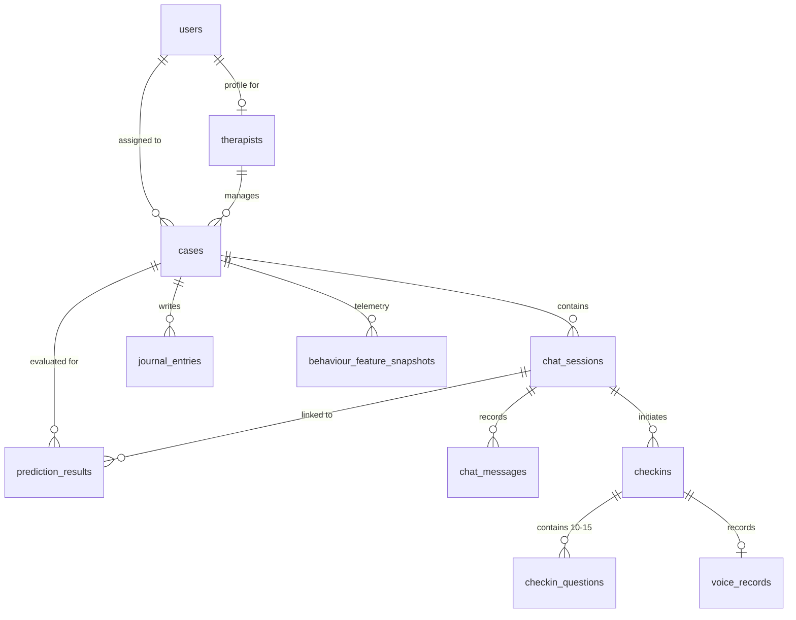

# MEDHA Database Architecture & Schema Specification

This document details the unified relational database architecture for MEDHA V2, deployed on PostgreSQL.

---

## 1. High-Level Entity-Relationship Overview



---

## 2. Core Tables Specification

### 2.1 `users`
Represents all system actors (Patients and Clinicians).
- `id` (UUID, Primary Key): Unique internal user identifier.
- `name` (VARCHAR): User's full display name.
- `email` (VARCHAR, Unique, Indexed): User's authentication email.
- `mobile` (VARCHAR, Nullable): Optional contact telephone.
- `role` (ENUM: `'USER'`, `'THERAPIST'`): Authorization permission tier.
- `status` (ENUM: `'ACTIVE'`, `'SUSPENDED'`, `'DEACTIVATED'`).
- `password_hash` (VARCHAR): Securely hashed password.
- `created_at`, `updated_at`, `last_login_at` (TIMESTAMP WITH TIME ZONE).

### 2.2 `therapists`
Clinician clinical workspace metadata.
- `id` (UUID, Primary Key).
- `user_id` (UUID, Foreign Key → `users.id`, Unique).
- `display_name` (VARCHAR).
- `specialty`, `license_number` (VARCHAR, Nullable).

### 2.3 `cases`
Longitudinal patient case file linking the patient to an authorized therapist.
- `id` (UUID, Primary Key).
- `victim_id` (VARCHAR, Unique, Indexed): Canonical research/clinical ID (e.g. `'V-LOW-001'`, `'V-CRIT-004'`).
- `user_id` (UUID, Foreign Key → `users.id`).
- `therapist_id` (UUID, Foreign Key → `therapists.id`).
- `current_timepoint` (INTEGER, Default: 1).
- `status` (VARCHAR: `'ACTIVE'`, `'CLOSED'`).

### 2.4 `chat_sessions`
Daily / assessment session container within a patient case.
- `id` (UUID, Primary Key).
- `case_id` (UUID, Foreign Key → `cases.id`).
- `session_identifier` (VARCHAR, Unique, Indexed).
- `timepoint` (INTEGER, Default: 1).
- `status` (VARCHAR: `'ACTIVE'`, `'ENDED'`, `'EXPIRED'`).
- `state_snapshot` (JSON, Nullable): Serialized snapshot of `MedhaState`.

### 2.5 `checkins`
Tracks individual daily check-in questionnaire sessions.
- `id` (UUID, Primary Key).
- `session_id` (UUID, Foreign Key → `chat_sessions.id`).
- `victim_id` (VARCHAR): Redundant clinical ID for fast indexing.
- `status` (VARCHAR: `'PENDING'`, `'IN_PROGRESS'`, `'COMPLETED'`).
- `current_question_id` (VARCHAR, Nullable).
- `started_at` (TIMESTAMP WITH TIME ZONE).
- `completed_at` (TIMESTAMP WITH TIME ZONE, Nullable).

### 2.6 `checkin_questions` ⭐
Contains the 10–15 randomized questions asked per check-in and the patient's submitted responses.
- `id` (UUID, Primary Key).
- `checkin_id` (UUID, Foreign Key → `checkins.id`, ON DELETE CASCADE).
- `question_id` (VARCHAR, Indexed): Standardized clinical code (e.g. `'SA-01'`, `'ES-02'`, `'SF-03'`).
- `question_text` (TEXT): The exact prompt presented to the user.
- `question_order` (INTEGER): 1-indexed progression order (1 to 15).
- `answer` (JSON, Nullable): Structured answer payload, e.g. `{"value": "No, I am alone", "question_id": "SA-04"}`.
- `answer_status` (VARCHAR: `'pending'`, `'answered'`).
- `answered_at` (TIMESTAMP WITH TIME ZONE, Nullable).

### 2.7 `prediction_results` ⭐ (Single Source of Truth)
Centralized multimodal clinical assessment prediction outputs.
- `id` (UUID, Primary Key).
- `case_id` (UUID, Foreign Key → `cases.id`, ON DELETE CASCADE).
- `session_id` (UUID, Foreign Key → `chat_sessions.id`, Nullable).
- `timepoint` (INTEGER).
- **Modality Scores** (Float, Nullable; absent modalities stay `NULL`, never `NaN`):
  - `structured_score`: From questionnaire features.
  - `text_score`: From journal / conversational text distress features.
  - `voice_score`: From acoustic prosody features.
  - `behaviour_score`: From telemetry engagement features.
- **Multimodal Fusion & Escalation**:
  - `fusion_score` (Float): Weighted multimodal distress score (0–100).
  - `triage_level` (VARCHAR: `'LOW'`, `'MEDIUM'`, `'HIGH'`, `'CRITICAL'`).
  - `temporal_risk` (Float, Nullable): Day-8 escalation risk predicted by Temporal GRU on 7-day history.
  - `future_escalation_flag` (INTEGER, Nullable): `1` if temporal risk exceeds safety threshold, else `0`.
- **Explainability & Recommendations**:
  - `explanation` (TEXT, Nullable): Non-diagnostic clinical summary.
  - `recommendation` (TEXT, Nullable): Recommended clinical action items for the therapist.
- **Modality Availability Audit Flags**:
  - `struct_available`, `text_available`, `voice_available`, `behav_available` (BOOLEAN).
- `predicted_at` (TIMESTAMP WITH TIME ZONE).

### 2.8 `voice_records`
Metadata and acoustic prosody extractions for audio check-in samples.
- `id` (UUID, Primary Key).
- `case_id` (UUID, Foreign Key → `cases.id`).
- `session_id` (UUID, Foreign Key → `chat_sessions.id`).
- `timepoint` (INTEGER).
- `audio_filename`, `storage_path` (VARCHAR).
- `duration_seconds` (FLOAT).
- `transcript` (TEXT, Nullable).
- `extracted_features` (JSON, Nullable): Extracted prosody (pitch, jitter, shimmer, HNR).
- `voice_score` (FLOAT, Nullable).

### 2.9 `journal_entries`
Long-form patient reflection entries feeding into the Text Specialist model.
- `id` (UUID, Primary Key).
- `case_id` (UUID, Foreign Key → `cases.id`).
- `content` (TEXT).
- `created_at`, `updated_at` (TIMESTAMP WITH TIME ZONE).

---

## 3. Useful SQL Inspection Queries

### View All Answers for a Specific Patient Check-in:
```sql
SELECT 
    q.question_order,
    q.question_id,
    q.question_text,
    q.answer->>'value' AS answer,
    q.answered_at
FROM checkin_questions q
WHERE q.checkin_id = 'YOUR_CHECKIN_ID'
ORDER BY q.question_order ASC;
```

### View Daily Longitudinal Predictions for a Case:
```sql
SELECT 
    p.timepoint,
    p.structured_score,
    p.text_score,
    p.voice_score,
    p.behaviour_score,
    p.fusion_score,
    p.triage_level,
    p.temporal_risk,
    p.predicted_at
FROM prediction_results p
WHERE p.case_id = 'YOUR_CASE_ID'
ORDER BY p.timepoint ASC;
```
