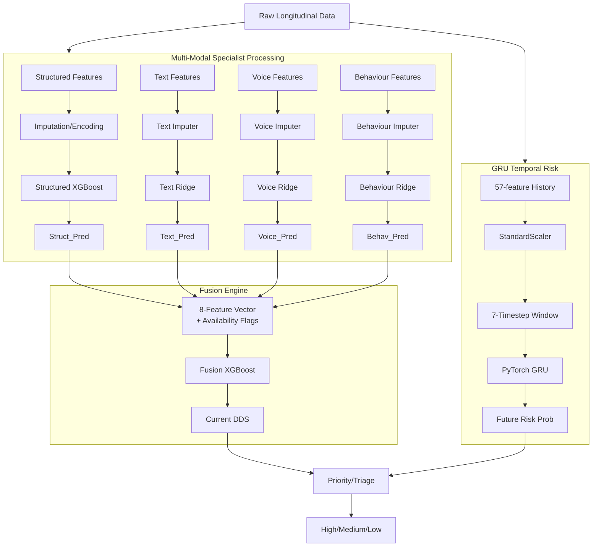

# MEDHA V2 Architecture

## 1. System Overview

MEDHA V2 receives longitudinal data describing a victim's ongoing case. This includes up to 42 structured fields (e.g. demographic, protective factors, case status), unstructured text, short voice samples (if available), and behavioral logs regarding app interaction. 

The system operates across three conceptual layers:

* **Current State Prediction (Current DDS)**: The system predicts the current subjective Distress level (0-100) using a multi-modal approach. To handle missing text or voice, four separate specialist models are trained (Structured, Text, Voice, Behaviour). An XGBoost Fusion Engine intelligently combines their predictions with availability flags, collapsing safely back to the baseline Structured prediction when other modalities are missing.
* **Future Risk Prediction**: A distinct PyTorch GRU model processes a strict 7-timestep sequence of historical (past) features to predict the probability (0-1) that the victim will experience an adverse escalation in the near future. This is completely separate from Current DDS to avoid target leakage.
* **Downstream Triage (Priority/Triage)**: A final logical ruleset uses both the Current DDS and Future Risk probability to assign a triage category (High, Medium, Low). 
  
*Note: Priority/Triage is an engineering demonstration of how to consume these signals and is not clinically validated.*

## 2. Complete End-to-End Diagram

## 3. Specialist Models

### Structured Specialist
* **Purpose**: Forms the robust baseline for Current DDS using 42 reliable tabular features.
* **Algorithm**: XGBoost Regressor
* **Input Features**: 42 (`v2_structured_dds_features.json`)
* **Preprocessing**: `ZeroImputerWithAvailabilityFlag` mapping. Missing continuous = median. Missing categorical = custom encoding.
* **Missing-data behavior**: Uses standard XGBoost missing capabilities/imputation. Never missing conceptually.
* **Output**: `Struct_Pred` (0-100)
* **Model Artifact Path**: `engine/models/structured_dds_v2/v2_structured_dds_xgb.json`

### Text Specialist
* **Purpose**: Extracts distress signals from language using MuRIL embeddings.
* **Algorithm**: Ridge Regression (Core-5)
* **Input Features**: 5 (`v2_text_dds_features.json` - `Text_Distress`, `Fear`, `Threat_Context`, `Negative_Affect`, `Urgency`)
* **Preprocessing**: Imputer.
* **Missing-data behavior**: If text is unavailable, prediction is mapped to `0.0` or `NaN` and flagged for the Fusion engine.
* **Output**: `Text_Pred` (0-100)
* **Model Artifact Path**: `engine/models/text_dds_v2/v2_text_dds_ridge_core5.pkl`

### Voice Specialist
* **Purpose**: Extracts distress signals from acoustic variations.
* **Algorithm**: Ridge Regression (Core-5)
* **Input Features**: 5 (`v2_voice_dds_features.json` - `Voice_Distress`, `Pause_Ratio`, `Speech_Rate_Deviation`, `Energy_Deviation`, `Acoustic_Indicator`)
* **Preprocessing**: Imputer.
* **Missing-data behavior**: If voice is unavailable, prediction is mapped to `0.0` or `NaN` and flagged.
* **Output**: `Voice_Pred` (0-100)
* **Model Artifact Path**: `engine/models/voice_dds_v2/v2_voice_dds_ridge_core5.pkl`

### Behaviour Specialist
* **Purpose**: Measures distress through interaction patterns (e.g. app usage latency).
* **Algorithm**: Ridge Regression (Ext-10)
* **Input Features**: 10 (`v2_behaviour_dds_features.json`)
* **Preprocessing**: Extracts absolute deviations on Engagement/Response delay, then passes through an Imputer.
* **Missing-data behavior**: Missing data imputed to means. Treated as always available.
* **Output**: `Behav_Pred` (0-100)
* **Model Artifact Path**: `engine/models/behaviour_dds_v2/v2_behaviour_dds_ridge_all10.pkl`

## 4. Fusion Engine

Because unstructured modalities (Text and Voice) are frequently missing (not every observation has a voice note or text message), a linear or naive average would fail unpredictably. The Fusion Engine learns how to rely on Text/Voice when they are available, and collapse securely onto the Structured prediction when they are missing, without penalizing the overall score.

**Exact 8-feature order**:
1. `Struct_Pred`
2. `Text_Pred`
3. `Voice_Pred`
4. `Behav_Pred`
5. `Struct_Available`
6. `Text_Available`
7. `Voice_Available`
8. `Behav_Available`

**Missing-modality handling**: 
When Text or Voice is unavailable, the corresponding prediction is zeroed for Fusion, and its availability flag is set to 0. The other specialist predictions remain active, and the learned XGBoost Fusion model processes the resulting 8-feature vector.

**Architecture (Candidate C)**:
* **Algorithm**: XGBoost Regressor
* **Hyperparameters**:
  * `n_estimators`: 100
  * `max_depth`: 3
  * `learning_rate`: 0.1
  * `subsample`: 0.8
  * `colsample_bytree`: 0.8
  * `reg_alpha`: 1.0
  * `reg_lambda`: 5.0

## 5. GRU

The GRU predicts Future Risk. It takes a sequence of historical vectors for a given victim. 

* **Input Features**: 57 explicit whitelisted numerical features.
* **Sequence**: 7 historical timesteps.
* **Target Leakage Guard**: Strictly past observations. Time step `i` is predicted using `[i-7 : i]`.
* **Preprocessing**: `StandardScaler` fitted strictly on Train data only.
* **Target**: `Future_Escalation_Label`
* **Loss**: `BCEWithLogitsLoss`
* **Handling Class Imbalance**: Uses a calculated `pos_weight`.
* **Optimizer**: Adam (`learning_rate` 0.001, `weight_decay` 0.0001).
* **Network Parameters**: `hidden_size` 64, `dropout` 0.3.
* **Training Dynamics**:
  * Best validation epoch = 4
  * Early stopping patience = 7
  * Training terminated at epoch = 11
  * Best checkpoint restored = epoch 4

## 6. Priority/Triage

The downstream triage layer logic evaluates the outputs of the ML models to assign priority. These thresholds and OR-logic rules are an engineering demonstration only and are not clinically validated.

* **CRITICAL**: Current DDS >= 75 OR Future Risk >= 0.85
* **HIGH**: Current DDS >= 50 OR Future Risk >= 0.50
* **MEDIUM**: Current DDS >= 25 OR Future Risk >= 0.25
* **LOW**: Current DDS < 25 AND Future Risk < 0.25
* **UNKNOWN**: both required upstream signals unavailable/invalid

**Missing Future Risk**: If a victim has <7 historical timesteps, Future Risk is unavailable (`Temporal_Available` = 0). The triage layer falls back to the available Current DDS signal according to the actual implementation.

## 7. V1 → V2 Migration

The V2 architecture was built to address critical target leakage in V1.

* **V1 Flaws**: The V1 GRU blindly consumed `numeric_cols[:72]`, which included `Previous_DDS`, `Rolling_DDS_Mean`, and other labels heavily correlated with the target, artificially inflating performance through data leakage. 
* **V2 Strict Bounds**: The V2 GRU explicitly whitelists 57 features (and `72` is explicitly abolished). V2 implements strict victim-level splits (zero overlap between Train/Val/Test).
* **OOF Fusion**: V2 Fusion uses Out-of-Fold (OOF) cross-fitting so the meta-learner is trained on realistic, unbiased specialist residuals. 
* **Frozen Architecture**: The entire V2 pipeline ran on a sealed Test set one time, and is now perfectly frozen. 
